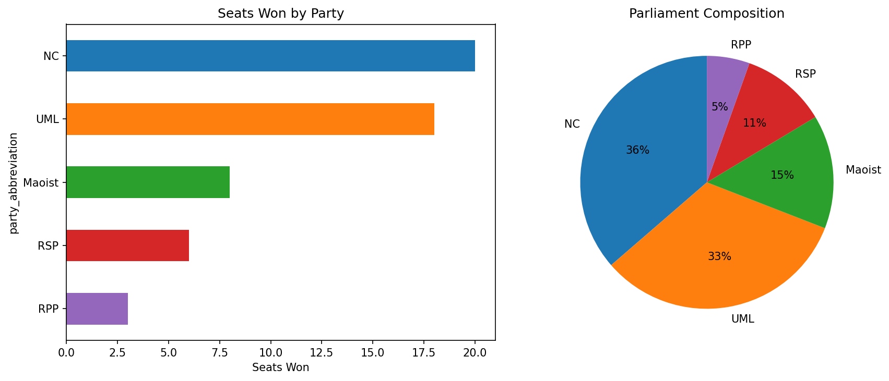
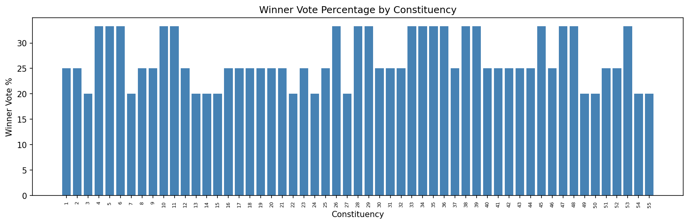
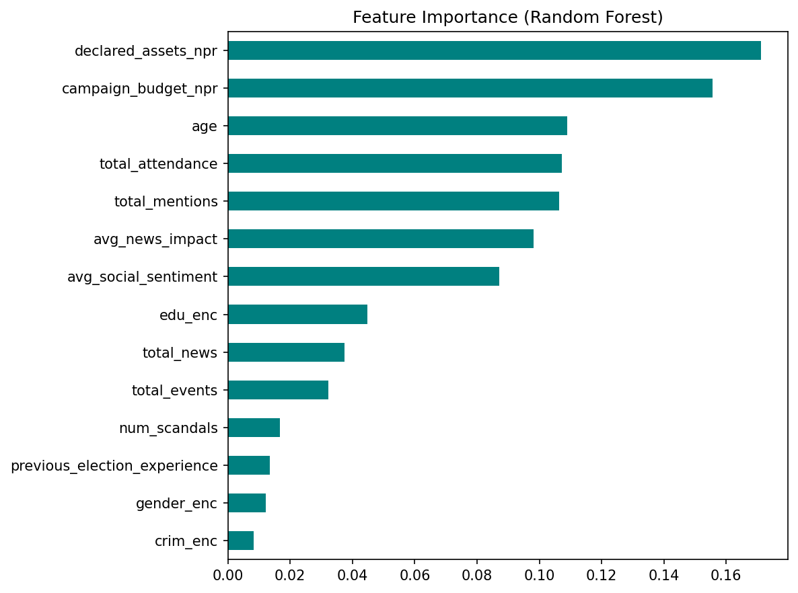
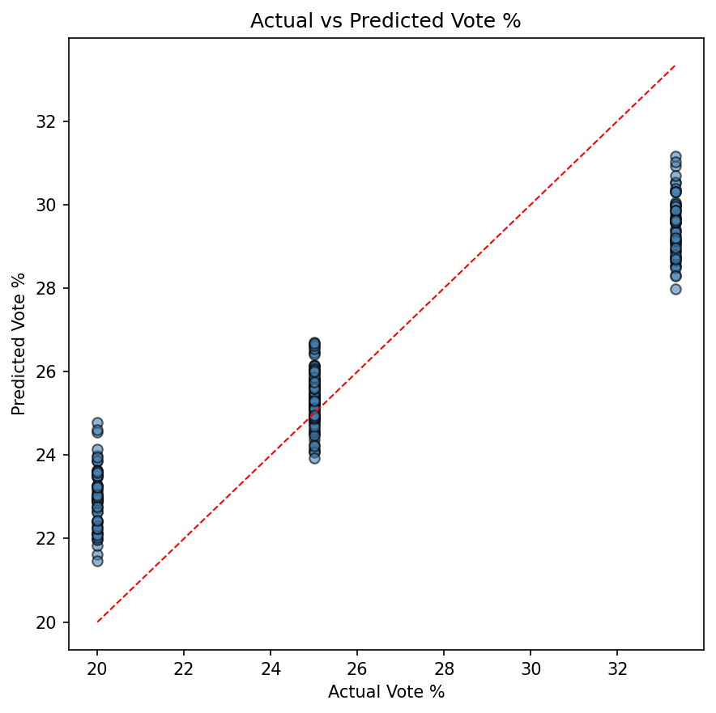

# Nepal Election 2082 - Data Analysis

A data analysis project exploring synthetic election data for Nepal's hypothetical 2082 BS general election. The dataset covers political parties, candidates, voters, votes, campaign events, social media trends, media coverage, and political scandals across 55 constituencies.

> **Disclaimer:** All data in this project is entirely **fictional and synthetically generated using Claude (Anthropic)**. It was created solely for **educational and learning purposes**. None of the data represents real election outcomes, real individuals, real political parties, or actual events. Any resemblance to real persons or organizations is purely coincidental and unintentional. **Do not cite this data as factual or use it for any real-world decision-making.**

## About the Data

The dataset is designed to mimic realistic patterns found in Nepali elections while being entirely synthetic. It was generated with the help of [Claude by Anthropic](https://www.anthropic.com/).

Dates use the **Bikram Sambat (BS) calendar**, consistent with Nepal's official calendar system (e.g., 2082-04-15).

## Sample Results

### Parliament Composition


### Winner Vote Percentage by Constituency


### Feature Importance (Random Forest Model)


### Prediction: Actual vs Predicted Vote %


## Project Structure

```
Election-2082/
├── data/                          # All CSV datasets
│   ├── political_parties_2082.csv
│   ├── candidates_2082.csv
│   ├── voters_2082.csv
│   ├── votes_2082.csv
│   ├── election_results_2082.csv
│   ├── campaign_events.csv
│   ├── social_media_trends.csv
│   ├── media_news_coverage.csv
│   └── political_scandals.csv
├── Analysis/
│   └── nepal_election_2082_analysis.ipynb   # Main analysis notebook
├── .venv/                         # Python virtual environment
└── Readme.md
```

## Dataset Overview

| Table | Rows | Columns | Description |
|-------|------|---------|-------------|
| `political_parties_2082.csv` | 26 | 9 | Party info: name, leader, ideology, members, symbol |
| `candidates_2082.csv` | 215 | 12 | Candidate profiles: age, gender, education, assets, budget |
| `voters_2082.csv` | 3,001 | 11 | Registered voters: demographics, location, voted flag |
| `votes_2082.csv` | 2,010 | 5 | Individual vote records linking voters to candidates |
| `election_results_2082.csv` | 215 | 7 | Aggregated results: vote count, percentage, rank per constituency |
| `campaign_events.csv` | 351 | 7 | Campaign rallies, speeches, etc. with attendance and media scores |
| `social_media_trends.csv` | 251 | 7 | Hashtag trends across platforms with sentiment scores |
| `media_news_coverage.csv` | 301 | 7 | News articles with sentiment and impact scores |
| `political_scandals.csv` | 81 | 6 | Scandal records with media attention and public reaction |

## Entity Relationships

```
political_parties  <──(party_id)──  candidates  <──(candidate_id)──  election_results
                                        │
                                   (candidate_id)
                                        │
                       ┌────────────────┼────────────────┐
                       ▼                ▼                ▼
                 campaign_events  social_media_trends  political_scandals
                                        │
                                        ▼
                               media_news_coverage

voters  ──(voter_id)──>  votes  <──(candidate_id)──  candidates
```

- `party_id` links parties to candidates and results
- `candidate_id` links candidates to votes, events, social media, news, and scandals
- `voter_id` links voters to their vote records
- `constituency_id` is shared across candidates, voters, votes, and results

## Analysis Sections

The notebook covers 20 analysis sections:

1. **Data Loading** — Load all 9 CSV tables, verify row counts
2. **Data Inspection** — Schema validation, dtypes, null checks
3. **Data Cleaning** — Type casting, BS date handling, categorical encoding
4. **Join Integrity** — Referential integrity checks across all tables
5. **Party Overview** — Ideology distribution, membership, establishment timeline
6. **Candidate Demographics** — Age, gender, education, profession, criminal status, budget
7. **Voter Demographics** — Age, gender, province, urban/rural, education, occupation
8. **Voter Turnout** — Overall and breakdown by province, gender, age, education
9. **Constituency Winners** — Winner table, vote percentage chart, landslide detection
10. **Parliament Composition** — Seat distribution, donut chart, proportionality analysis
11. **Constituency Competitiveness** — Candidate counts, budget advantage proxy analysis
12. **Gender Representation** — Win rates by gender, Mann-Whitney U test
13. **Campaign Activity** — Events, attendance, media score vs vote correlation
14. **Social Media Sentiment** — Sentiment and mentions vs vote share, linear regression
15. **Media News Coverage** — Sentiment breakdown per party, net sentiment ratio
16. **Scandal Impact** — Vote share and win rate comparison, statistical testing
17. **Controversial Candidates** — Composite controversy score, bubble chart
18. **Wealth vs Outcome** — Assets and budget vs win probability, logistic regression
19. **Timeline Analysis** — Campaign events, social media, news over time
20. **Multi-Factor Model** — Random Forest predicting vote percentage, feature importance

## Tech Stack

- **Python 3.14**
- **pandas** — data manipulation
- **numpy** — numerical operations
- **matplotlib / seaborn** — visualization
- **scipy** — statistical tests (Mann-Whitney U, Pearson, Spearman)
- **scikit-learn** — Linear Regression, Logistic Regression, Random Forest, cross-validation

## Getting Started

```bash
# clone the repo
git clone <repo-url>
cd Election-2082

# create virtual environment
python -m venv .venv
.venv\Scripts\activate      # Windows
# source .venv/bin/activate  # Linux/Mac

# install dependencies
pip install pandas numpy matplotlib seaborn scipy scikit-learn

# open the notebook
jupyter notebook Analysis/nepal_election_2082_analysis.ipynb
```

## Known Data Quirks

- **Equal vote counts**: In this synthetic dataset, every candidate in a constituency receives `vote_count = 100` and `vote_percentage = 100/N` (where N = number of candidates). Traditional margin-of-victory analysis returns zero everywhere. The notebook uses alternative competitiveness proxies instead.
- **BS calendar dates**: Dates like `2082-04-15` are Bikram Sambat and cannot be parsed by `pd.to_datetime()`. They are kept as strings and sorted lexicographically.
- **15 independent candidates** have `party_id = NaN`, handled with fillna in the analysis.

## License

This project and its synthetic data are provided for educational purposes only.

> **Reminder:** This is NOT real data. Everything — parties, candidates, voters, votes, results, scandals — is synthetically generated for learning. Do not treat any of it as factual.

## Regenerating Images

To regenerate the charts from the CSVs (non-interactive):

```bash
.venv\Scripts\activate   # Windows
python scripts/export_images.py
```

This creates the following in `images/`:

| File | Description |
|------|-------------|
| `parliament.png` | Seat distribution bar + donut chart |
| `winner_vote_pct.png` | Winner vote % by constituency |
| `feature_importance.png` | Random Forest feature importance |
| `prediction_scatter.png` | Actual vs predicted vote % scatter |
| `predictions.csv` | Per-candidate actual & predicted vote % |